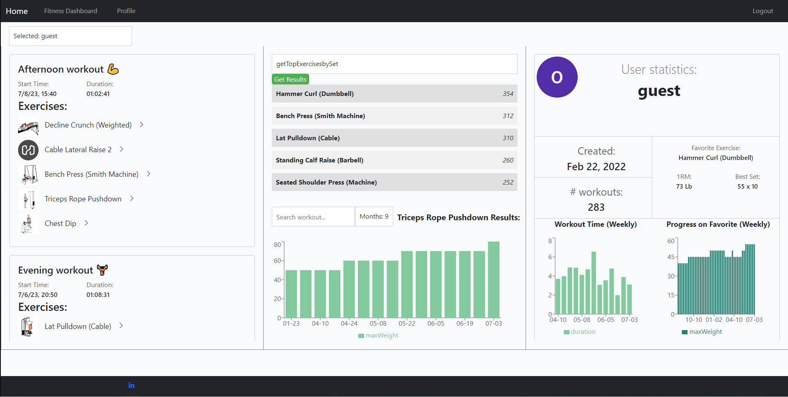

# A MERN stack Webapp that utilizes Hevy's API to display user information
Live App: [https://hevy-webapp.onrender.com/](https://hevy-webapp.onrender.com/)\
guest login for app exists if you do not have a Hevy account (username: guest, password: guest)\
Hevy workout app site: https://www.hevyapp.com/ \
Users are able to follow other users if they know their name. If you follow another user you can see their data and if they follow you they have access to your workouts.

# Motivation
 I wanted to build a project that would give me full access to my workout data and allow me to use it measure progress in the gym as well as other interesting statistics.\
 Hevy currently limits free users by only allowing them to see data for the past 3 months. By utilizing Hevy's hidden API, this web application is capable of downloading all of a user's data for further use.\
